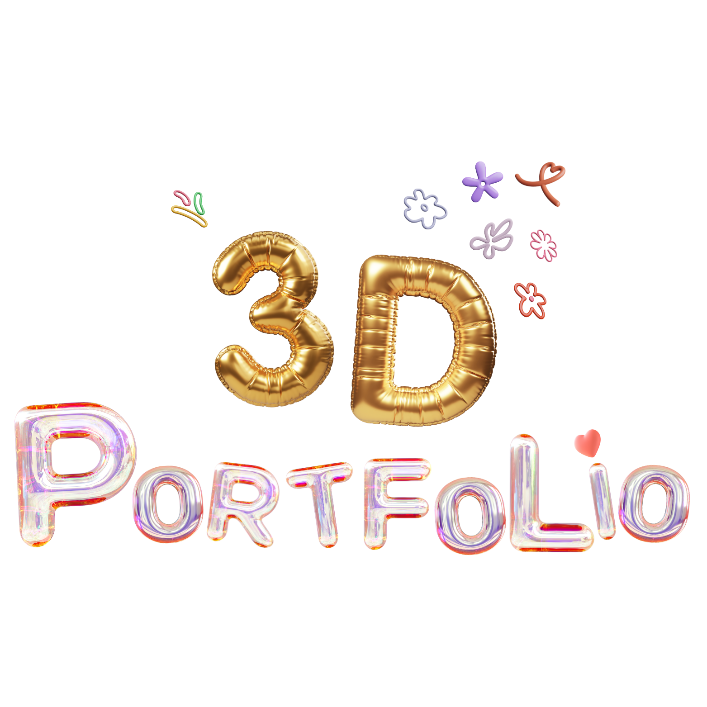

<!-- PROJECT LOGO -->
<br />
<div align="center" id ="readme-top">
    

  <h3 align="center">3D Portfolio</h3>

  <p align="center" >
    My Awesome 3D Portfolio
    <br />
    ✨
    <a href="https://github.com/othneildrew/Best-README-Template">View Website</a>
    ✨
  </p>
</div>


<!-- TABLE OF CONTENTS -->
<details>
  <summary> 📚 Table of Contents</summary>
  <ol>
    <li>
      <a href="#about-the-project"> 💁🏻‍♀️ About The Project</a>
      <ul>
        <li><a href="#built-with">🛠️ Built With</a></li>
      </ul>
    </li>
    <li>
      <a href="#getting-started">✨ Getting Started</a>
      <ul>
        <li><a href="#packages-installed">📦 Packages Installed</a></li>
        <li><a href="#installation"> ⬇️ Installation</a></li>
      </ul>
    </li>
    <li>
      <a href="#education-section">📚 Education section</a>
      <ul>
        <li><a href="#three.js-notes">🪩 Three.js Notes</a></li>
        <li><a href="#react-notes">🪩 React Notes</a></li>
      </ul>
    </li>

  </ol>
</details>


<!-- ABOUT THE PROJECT -->
## 💁🏻‍♀️ About The Project

This is a 3D Portfolio created using React, Three.js, and Tailwind CSS. It showcases my skills and projects in an interactive 3D environment.


### 🛠️ Built With 


<p align="right">(<a href="#readme-top">back to top</a>)</p>


<!-- GETTING STARTED -->
## ✨ Getting Started


#### 📦 Packages Installed
  - `npm create vite@latest`
  - `npm install tailwindcss @tailwindcss/vite`
  - `npm install react-three-fiber three`
  - `npm install @react-three/fiber`
  - `npm install @react-three/drei`
  - `npm install leva`
  - `npm install gsap`
  - `npm i react-responsive`

#### ⚡️ Installation
1. Clone the Repository
```bash
gh repo clone NguyenCatNguyen/3D-Portfolio
```


<p align="right">(<a href="#readme-top">back to top</a>)</p>


## 📚 Education section
### Three.js Notes
1. Canvas
    - Canvas is the container for all the 3D objects.
    - Everything inside the Canvas is a 3D object.
```jsx
import { Canvas } from '@react-three/fiber'

return(
    <Canvas>
    
    </Canvas>
)
```

### React Notes
#### Tenary Operator useCase
##### ⭐️ UseState can also be use with Tenary Operator to display icons
  ```jsx
  const [isOpen, setIsOpen] = useState(false);
  return(
      <div>
        
      </div>
  )
  ```
  - Use Tenary Operator right inside the className to add or remove classes.
  ```jsx
  <div className={`nav-sidebar ${isOpen ? "max-h-screen" : "max-h-0"}`}>
  </div>
  ```

##### ⭐️ Make custom className with Tenary Operator
  ```jsx
  className={`${className ?? ""} cta-wrapper`}
  ```

##### ⭐️ Efficent way to create `NavList`
   - Create NavItem component right on top of Nav component.
   - Directly create a list of items inside the NavItem component.
   ```jsx
   const NavItem = () => {
       return(
           <ul className='nal-ul'>
               {["Home", "About", "Project", "Contact"].map((item, index) => (
                   <li key={index} className='nav-li'>
                       <a href="" className='nav-li_a'>{item}</a>
                   </li>
               ))}
           </ul>
       )
   }

   const Nav = () => {
       return(
           <nav className='nav'>
               <NavItem />
           </nav>
       )
   }
   ```


   <p align="right">(<a href="#readme-top">back to top</a>)</p>